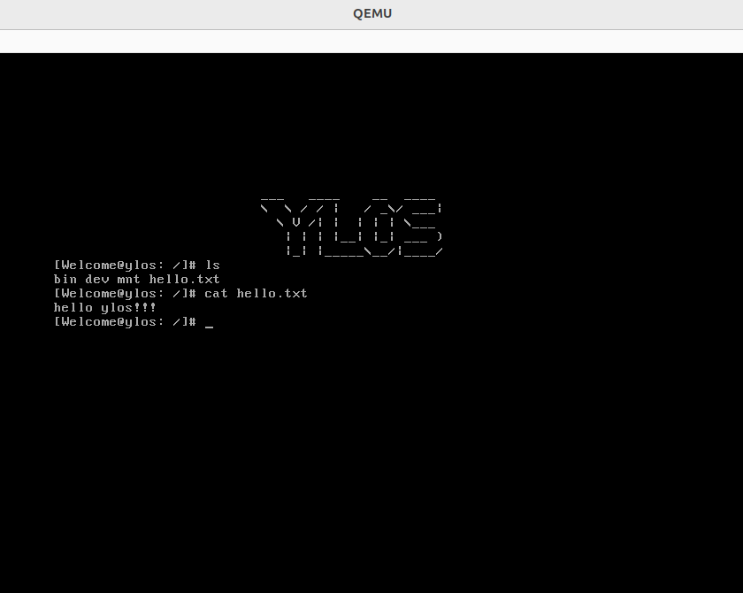

# Ylos - 操作系统实现

# 参考文献

## 相关网页

1. <https://wiki.osdev.org>

    这里有你想要的几乎一切！！！

## 参考项目

1. <https://github.com/StevenBaby/alinux>
2. <https://github.com/ringgaard/sanos>
3. <https://github.com/szhou42/osdev>

## 参考书目

1. [郑刚 / 操作系统真象还原 / 人民邮电出版社 / 2016](https://book.douban.com/subject/26745156/)

2. [赵炯 / Linux内核完全注释 / 机械工业出版社 / 2005](https://book.douban.com/subject/1231236/)

3. [李忠 / 王晓波 / 余洁 / x86汇编语言 / 电子工业出版社 / 2013](https://book.douban.com/subject/20492528/)

4. [[日] 川合秀实 / 30天自制操作系统 / 人民邮电出版社 / 2012](https://book.douban.com/subject/11530329/)

5. [王爽 / 汇编语言（第2版） / 清华大学出版社 / 2008](https://book.douban.com/subject/3037562/)

6.  [Maurice J.Bach / UNIX操作系统设计 / 机械工业出版社 / 2000](https://book.douban.com/subject/1035710/)

7. [[美] Robert Love / Linux内核设计与实现 / 机械工业出版社 / 2011](https://book.douban.com/subject/6097773/)

8. [Paul A. Carter / PC Assembly Language / Amazon Digital Services LLC / 2016](https://book.douban.com/subject/26892163/)

9. [Robert Mecklenburg / Managing Projects with GNU Make / O'Reilly Media / 2004](https://book.douban.com/subject/1850994/)

 10. [Remzi H. Arpaci-Dusseau and Andrea C. Arpaci-Dusseau. Operating Systems: Three Easy Pieces. Arpaci-Dusseau Books, 2018](https://book.douban.com/subject/19973015/)

 11. [Randal E. Bryant and David R. O'Hallaron. Computer Systems: A Programmer's Perspective (3ed). Pearson, 2017](https://book.douban.com/subject/26912767/)
